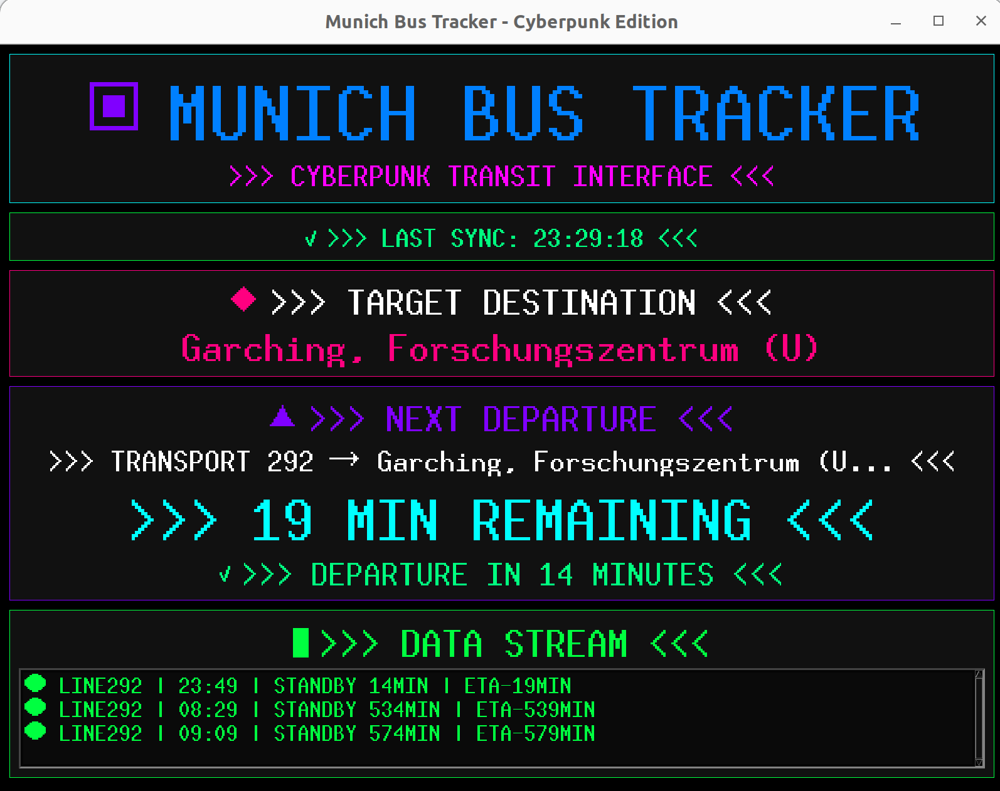

# Munich Bus Tracker

A **cyberpunk-style** bus tracking application designed for PhD students and commuters in Munich who need to catch their buses with futuristic neon interface vibes.



## ✨ Features

- **🔄 Real-time bus tracking** with MVG API integration
- **🚨 Prominent "Leave Now" alerts** with cyberpunk color cycling
- **🎨 Cyberpunk neon UI** with electric colors, matrix effects, and dynamic animations
- **⚡ Optimized performance** with efficient animations and reduced API calls
- **🔄 Automatic updates** every 10 seconds to keep you informed
- **📱 Responsive design** that works on various screen sizes (optimized for 1600x1200)
- **🎯 Smart notifications** with cyberpunk-style color-coded status indicators
- **🛡️ Robust error handling** with graceful fallbacks and icon compatibility

## 🖥️ User Interface

The application features a sophisticated **cyberpunk dark theme** with:
- **Neon glow borders** and electric effects for visual depth
- **Animated icons** with rapid color cycling through electric blue, matrix green, laser red, and electric purple
- **Matrix-style status indicators** with fallback text compatibility
- **Enhanced typography** with consistent font scaling (fonts stay the same size)
- **Smooth cyberpunk animations** with color cycling and pulsing effects
- **Electric button feedback** with multi-color cycling effects

## 🚀 Getting Started

### Prerequisites

- Python 3.7+
- tkinter (usually comes with Python)

### Installation

1. Clone the repository:
   ```bash
   git clone https://github.com/your-username/munich-bus-tracker.git
   cd munich-bus-tracker
   ```

2. Install dependencies:
   ```bash
   pip install -r requirements.txt
   ```

3. Run the application:
   ```bash
   python bus_tracker_ui.py
   ```

## ⚙️ Configuration

To customize the application for your needs:

1. **Change the station**: Edit the `station` name in the `setup_mvg_api()` method
2. **Set your destination**: Modify the `target_destination` variable
3. **Adjust walk time**: Change `walk_time_minutes` to match your walking speed
4. **Update frequency**: Modify `update_interval` for different refresh rates

Example configuration:
```python
# In the __init__ method
self.target_destination = 'Your Destination Here'
self.walk_time_minutes = 7  # Your walking time in minutes
self.update_interval = 15   # Update every 15 seconds
```

## 🎯 How to Use

1. **Launch the application** and wait for the ">>> NEURAL LINK ESTABLISHED <<<"
2. **Monitor the countdown** to see when your next transport arrives
3. **Watch for cyberpunk alerts** - the app will tell you exactly when to leave
4. **Use the prominent "LEAVE NOW" alert** with color cycling when it's time to go
5. **Check the data stream** for upcoming transports with matrix-style formatting

## 🔧 Technical Features

- **Enhanced icon compatibility**: Automatic fallback to cyberpunk text symbols if special characters don't render
- **Cyberpunk color-coded status**: Matrix green (connected), Electric blue (waiting), Laser red (alerts)
- **Dynamic animations**: Multi-layer color cycling, pulsing effects, and matrix-style text changes
- **Error recovery**: Graceful handling of API failures with cyberpunk error messages
- **Threading**: Non-blocking UI updates with background data fetching
- **Optimized window size**: 1600x1200 resolution optimized for font readability

## 🙏 Acknowledgments

- Thanks to [mondbaron/mvg](https://github.com/mondbaron/mvg) for the excellent MVG API wrapper
- Inspired by the daily commute struggles of PhD students (maybe just me) in Munich
- Built with Cursor within 2 hours, thank you bros, Claude-4-sonnet & Cursor.

---

*>>> NEVER MISS YOUR TRANSPORT AGAIN! <<<* 🚌⚡🎮